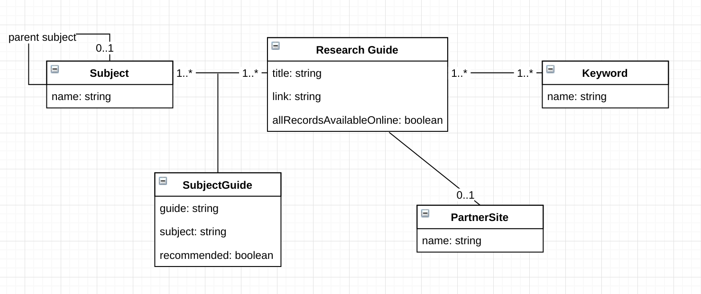

# Research Guides Single Page (Iteration Two)

## Purpose 

As part of the Cloud project we intend to serve WordPress pages as staticised HTML page. 

This requires us to explore potential for existing applications that rely upon WordPress/PHP logic to be delivered as HTML pages which are then progressively enhanced to be single-page JavaScript applications. 

## Required functionality

To replicate existing functionality, the application should allow users to: 

* Search for **guides** by name
* Filter guides by **keyword**
* Filter keywords by starting letter
* Find guides within a **subject grouping**
* Find guides related to a specific **subject**

The relationship between these entities is shown in 

### HTML structure required to support this

To achieve this there are specific needs for the HTML delivered by WordPress. Initial thoughts are that this would be two distinct structures: 

* One that represents the parent/child relationship between **subjects**
* One that represents the whether a guide is for records that are all online, and the relationship between:
    * A research guide and a subject (incl. whether the guide is 'recommended' for a particular subject)
    * A research guide and keywords
    
A [proposed HTML structure](proposed-html-structure.html) is included in this repository (and will be updated as necessary).

## Working with this repository

This project was generated with [Angular CLI](https://github.com/angular/angular-cli) version 1.3.2.

### Development server

Run `ng serve` for a dev server (use the `--open` switch to automatically open a browser). Navigate to `http://localhost:4200/`. The app will automatically reload if you change any of the source files.

### Code scaffolding

Run `ng generate component component-name` to generate a new component. You can also use `ng generate directive|pipe|service|class|guard|interface|enum|module`.

### Build

Run `ng build` to build the project. The build artifacts will be stored in the `dist/` directory. Use the `-prod` flag for a production build.

### Running unit tests

Run `ng test` to execute the unit tests via [Karma](https://karma-runner.github.io).

### Running end-to-end tests

Run `ng e2e` to execute the end-to-end tests via [Protractor](http://www.protractortest.org/).
Before running the tests make sure you are serving the app via `ng serve`.